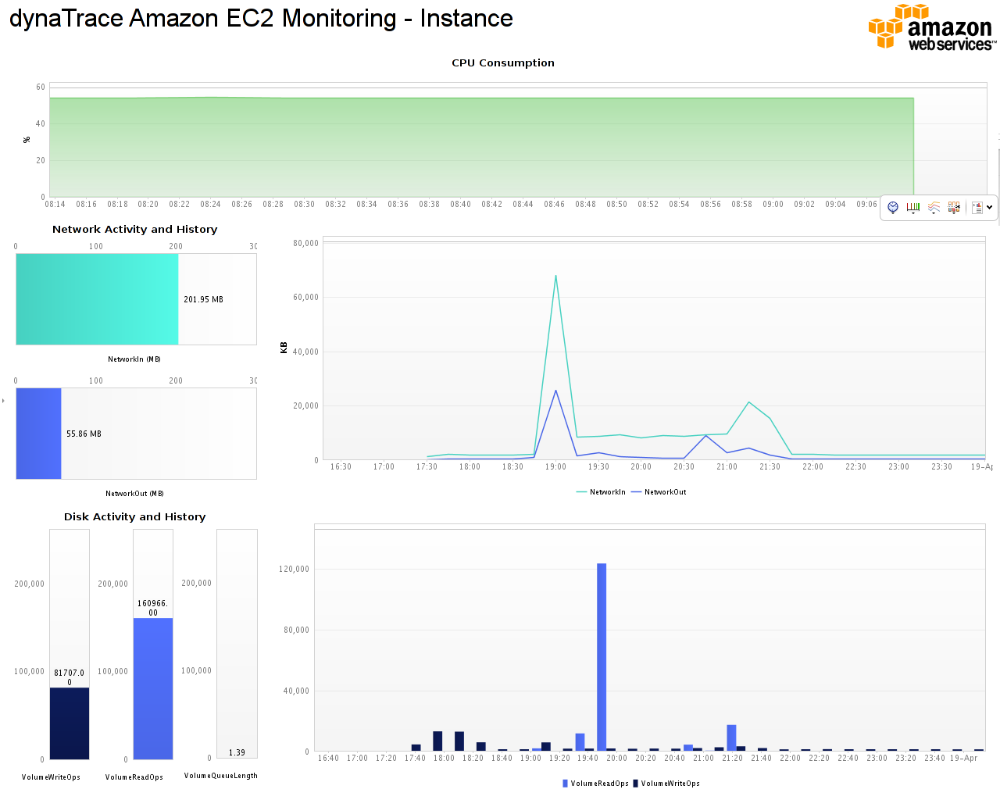
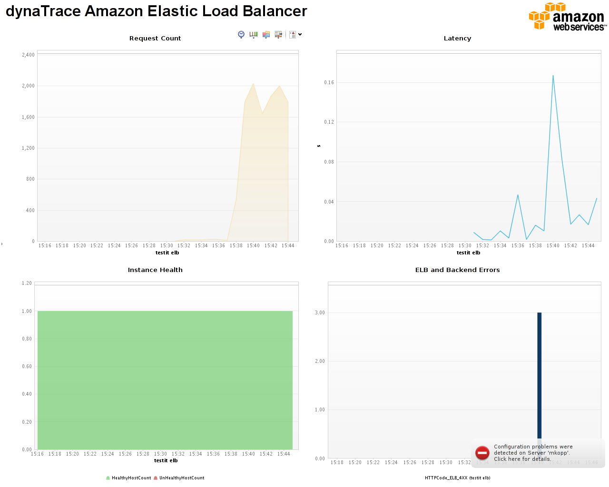
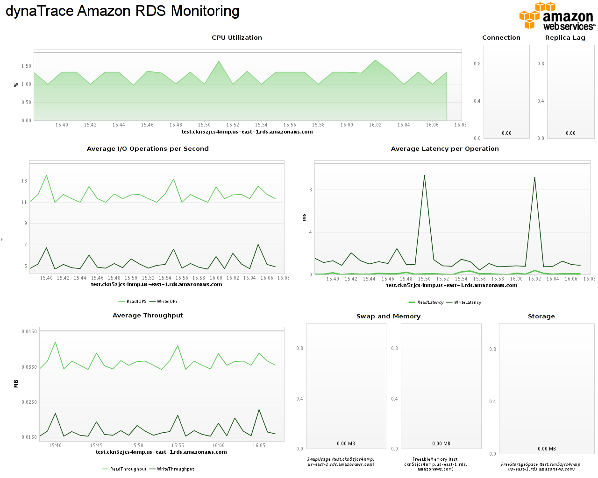

<html xmlns="http://www.w3.org/1999/xhtml">
<head>
    <title>Amazon AWS Fastpack</title>
    <link type="text/css" rel="stylesheet" href="css/blueprint/liquid.css" media="screen, projection"/>
    <link type="text/css" rel="stylesheet" href="css/blueprint/print.css" media="print"/>
    <link type="text/css" rel="stylesheet" href="css/content-style.css" media="screen, projection, print"/>
    <link type="text/css" rel="stylesheet" href="css/screen.css" media="screen, projection"/>
    <link type="text/css" rel="stylesheet" href="css/print.css" media="print"/>
</head>
<body>
    

        

            

                
            

            

                <h4>Amazon AWS Fastpack</h4>
            

        

      

        

            

                <h3>Table of Contents
                                        (<a href="Amazon_AWS_Fastpack.html">Start</a>)
                                    </h3>
                
<ul class="toc">
</ul>

            

            

            

                <h1>Amazon AWS Fastpack</h1>
    

        <h2>Overview</h2>
    
    

        <h3>Amazon AWS Fastpack</h3>
    
    

            
        The dynaTrace FastPack for Amazon AWS enables easy out-of-the-box monitoring of various AWS solutions via Cloud Watch. The Fastpack consists of a customer Monitor, several Dashboards and a System Profile.    

    

    

    

        
    

This Fastpack is for dynaTrace 4.2 and contains new features. for older dynaTrace versions please look for the <a href="https://community/display/DL/Amazon+EC2+FastPack">Amazon EC2 FastPack</a>    

    

    
    

    
    

    
    

        <h2>Fast Pack Details</h2>
    
    

        <table>
<thead class=" "></thead><tfoot class=" "></tfoot><tbody class=" ">    <tr>
            <td rowspan="1" colspan="1">
        

Name    

            </td>
                <td rowspan="1" colspan="1">
        

<strong class=" ">Amazon AWS FastPack</strong>    

            </td>
        </tr>
    <tr>
            <td rowspan="1" colspan="1">
        

Version    

            </td>
                <td rowspan="1" colspan="1">
        

1.0.0    

            </td>
        </tr>
    <tr>
            <td rowspan="1" colspan="1">
        

dynaTrace Version    

            </td>
                <td rowspan="1" colspan="1">
        

4.2    

            </td>
        </tr>
    <tr>
            <td rowspan="1" colspan="1">
        

Author    

            </td>
                <td rowspan="1" colspan="1">
        

dynaTrace - Michael Kopp    

            </td>
        </tr>
    <tr>
            <td rowspan="1" colspan="1">
        

License    

            </td>
                <td rowspan="1" colspan="1">
        

<a href="attachments_5275722_2_dynaTraceBSD.txt">dynaTrace BSD</a>    

            </td>
        </tr>
    <tr>
            <td rowspan="1" colspan="1">
        

Support    

            </td>
                <td rowspan="1" colspan="1">
        

<a href="https://community/display/DL/Support+Levels#SupportLevels-Community">Not Supported </a>    

            </td>
        </tr>
    <tr>
            <td rowspan="1" colspan="1">
        

FastPack Contents    

            </td>
                <td rowspan="1" colspan="1">
        

<a href="attachments_89096418_1_dynaTrace_AWSFastpack.dtp">Fastpack Download</a> contains:    

<ul class=" "><li class=" ">    

Cloud Watch Monitor for EC2, ELB and RDS    

</li><li class=" ">    

Amazon Simple DB Sensor Support    

</li><li class=" ">    

Monitoring Dashboards    

</li></ul>            </td>
        </tr>
</tbody>        </table>
            

    

    
    

        <h2>Monitoring EC2 Instances</h2>
    
    

            
            

    

The Instance Monitoring provides an overview of the relevant CloudWatch metrics for a specific cloud instance. The dashboard shows live and historical data about    

<ul class=" "><li class=" ">    

CPU Consumption    

</li><li class=" ">    

Network Activity and    

</li><li class=" ">    

Disk Activity    

</li></ul>    

This dashboard assists you in the verification of the health of your Amazon EC2 Instance. The CloudWatch monitor delivers the metrics for all attached EBS volumes separately as dynamic measures, but the dashboard simply charts a summary.    

    

    
    

        <h2>Amazon EC2 Load Balancer Dashboard</h2>
    
    

            
            

    

The load balancer dashboard provides an overview of load balancer specific metrics like Latency, the number of healthy and unhealthy hosts and the number of errors produced by the load balancer as opposed to the application itself.    

    

    
    

        <h2>Monitoring RDS Instances</h2>
    
    

            
            

    

The RDS Monitoring provides an overview of the relevant metrics of a specific RDS instances. It is meant to be viewed for a single RDS instance . The dashboard shows live and historical data about    

<ul class=" "><li class=" ">    

CPU Consumption    

</li><li class=" ">    

Average I/O operations load and throughput    

</li><li class=" ">    

Average I/O latency    

</li><li class=" ">    

Number of Connections    

</li><li class=" ">    

Memory and Swap usage    

</li><li class=" ">    

Time lag of the Replicas    

</li></ul>    

This dashboard assists you in the verification of the health of your Amazon RDS Instance and can help explain why SQL statements executed against that instance might have been slow.    

    

    
    

        <h2>Amazon CloudWatch Monitor</h2>
    
    

The Amazon CloudWatch Monitor supports monitoring of instances EC2 and RDS Instances as well as load balancers. If need it to be extended to any other CloudWatch provider please ask so in the forum. You will receive data even if you do not enable cloud watch specifically, but for most types of data it will have only a 5 minute granularity. If you enable detailed monitoring you will receive data every minute. If you have detailed monitoring for only some of the instances, set it up to be scheduled once a minute and the monitor will do the rest.    

    

The Monitor is configured by supplying the following parameters:    

<ul class=" "><li class=" ">    

Your Amazon AWS AccessKeyID.    

</li><li class=" ">    

Your Amazon AWS SecretAccesskey.    

</li><li class=" ">    

Http Proxy and port if that is necessary in your environment    

</li><li class=" ">    

Additional Amazon Zones to check, separated by a semi colon (for a list of regions look <a href="http://docs.amazonwebservices.com/general/latest/gr/rande.html">here</a>). On default the Monitor only checks the default the us-east-1 region, with this setting you can add other zones to check as well.    

</li></ul>    

The monitor will use the supplied host (or host list) to figure out the instances to monitor. In case you run completely in the EC2 Cloud you can just add the hostgroup &quot;Local&quot; to the monitor and it will automatically monitor all your ec2 instances that have a dynaTrace agent placed. In order to monitor RDS and ELB instances simply add the hostname to the infrastructure section of the server configuration and make sure it is within the monitored host group. You do not have to setup a separate monitor for EC2 or RDS, the monitor will figure this out on its own.    

    

The monitor uses the auto discovered hostnames to identify the EC2 instance. While this works from outside the EC2 cloud, it works best if the collector that does the monitoring sits itself in the same EC2 region as the instances it monitors.    

    

In addition to using the monitor we recommend using the dynaTrace Agent and Collector to get more detailed system and application metrics.    

    

    
    

        <h2>FastPack Information</h2>
    
    

The Amazon AWS FastPack contains everything to get started with Amazon cloud monitoring.    

<ul class=" "><li class=" ">    

A system profile with preconfigured schedules for monitoring EC2 and RDS Instances as well as Elastic Load Balancers.    

</li><li class=" ">    

The EC2 Instance monitoring dashboard    

</li><li class=" ">    

The RDS Instance monitoring dashboard    

</li><li class=" ">    

The Load Balancer monitoring dashboard.    

</li></ul>    

    
    

        <h2>Installation</h2>
    
<ol class=" "><li class=" ">    

Download and install the Fastpack to your dynaTrace Server    

</li></ol>    

    
            

        

        

            Created with <a href="http://k15t.com/display/en/Scroll-Wiki-HTML-Exporter-for-Confluence-Overview">Scroll Wiki HTML Exporter for Confluence</a>.
        

    

</body>
</html>
